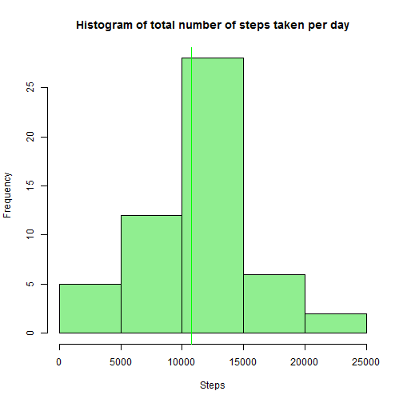
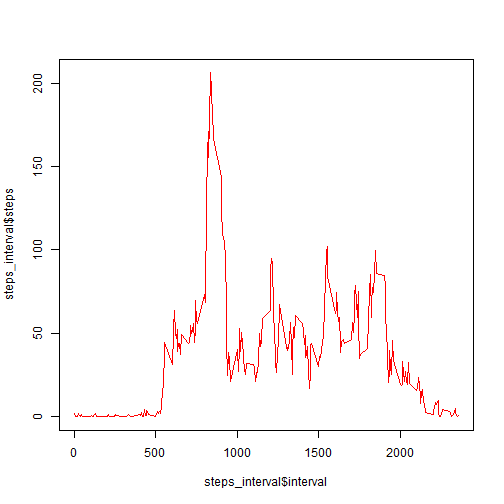
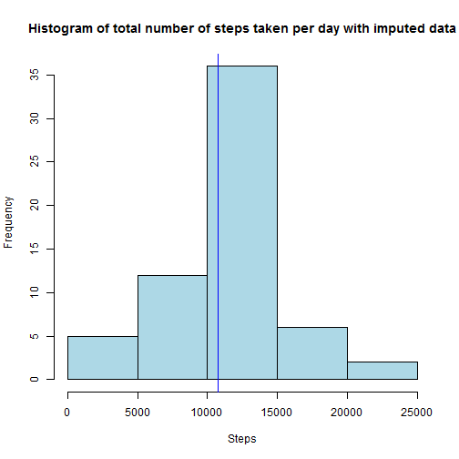

Reproducible Research: Peer Assessment 1
========================================================

## Loading and processing data

Let's load the data from the csv file into a variable called activity.
Once the data is loaded, we can look at a quick summary using the str() function


```r
activity <- read.csv("activity.csv")
str(activity)
```

```
## 'data.frame':	17568 obs. of  3 variables:
##  $ steps   : int  NA NA NA NA NA NA NA NA NA NA ...
##  $ date    : Factor w/ 61 levels "2012-10-01","2012-10-02",..: 1 1 1 1 1 1 1 1 1 1 ...
##  $ interval: int  0 5 10 15 20 25 30 35 40 45 ...
```
Converting the column 'date' from class Factor to Date


```r
activity$date <- as.Date(activity$date, format="%Y-%m-%d")
str(activity)
```

```
## 'data.frame':	17568 obs. of  3 variables:
##  $ steps   : int  NA NA NA NA NA NA NA NA NA NA ...
##  $ date    : Date, format: "2012-10-01" "2012-10-01" ...
##  $ interval: int  0 5 10 15 20 25 30 35 40 45 ...
```


## What is the mean of the total steps taken?

#### 1) Make a histogram of the total number of steps taken each day

```r
suppressWarnings(library(plyr))
total_steps <- ddply(activity,"date",summarise,steps_per_day=sum(steps))
mean_steps <- mean(total_steps$steps_per_day,na.rm=T)
median_steps <- median(total_steps$steps_per_day,na.rm=T)

hist(total_steps$steps_per_day, xlab="Steps", main="Histogram of total number of steps taken per day",col="lightgreen")
abline(v=mean_steps,col="green")
```

 

#### 2) Calculate and report the mean and median total number of steps taken per day


```r
mean_steps
```

```
## [1] 10766.19
```

```r
median_steps
```

```
## [1] 10765
```
The mean of the total number of steps taken per day is 1.0766189 &times; 10<sup>4</sup>.
The median of the total number of steps taken per day is 10765

## What is the average daily activity pattern?

#### 1) Make a time series plot (i.e. type = "l") of the 5-minute interval (x-axis) and the average number of steps taken, averaged across all days (y-axis)


```r
steps_interval <- ddply(activity,"interval",summarise,steps=mean(steps,na.rm=T))
plot(steps_interval$interval,steps_interval$steps,type="l",col="red")
```

 


#### 2) Which 5-minute interval, on average across all the days in the dataset, contains the maximum number of steps?


```r
max_interval <- steps_interval[which.max(steps_interval$steps),]$interval
max_interval
```

```
## [1] 835
```

The interval at which the average maximum number of steps were taken is at interval 835

## Imputting missing values

#### 1) Calculate and report the total number of missing values in the dataset

```r
total_na <- sum(is.na(activity$steps))
total_na
```

```
## [1] 2304
```
The total number of rows with missing values (NA values) is 2304

#### 2) Devise a strategy for filling in all of the missing values in the dataset. The strategy does not need to be sophisticated. For example, you could use the mean/median for that day, or the mean for that 5-minute interval, etc.

#### 3) Create a new dataset that is equal to the original dataset but with the missing data filled in.

As previously calculated, the mean of the steps taken during each interval across all days is used to fill in place of missing values.
The new dataset created with the imputed values is called 'imputed'.


```r
imputed <- activity
for (i in 1:nrow(imputed)) {
    if (is.na(imputed$steps[i])) {
        index_imputed <- which(steps_interval$interval == imputed[i, ]$interval)
        imputed$steps[i] <- steps_interval[index_imputed, ]$steps
    }
}
```

#### 4) Make a histogram of the total number of steps taken each day and Calculate and report the mean and median total number of steps taken per day. Do these values differ from the estimates from the first part of the assignment? What is the impact of imputing missing data on the estimates of the total daily number of steps?


```r
total_imputed_steps <- ddply(imputed,"date",summarise,steps_per_day=sum(steps))
mean_imputed_steps <- mean(total_imputed_steps$steps_per_day,na.rm=T)
median_imputed_steps <- median(total_imputed_steps$steps_per_day,na.rm=T)

hist(total_imputed_steps$steps_per_day, xlab="Steps", main="Histogram of total number of steps taken per day with imputed data",col="lightblue")
abline(v=mean_imputed_steps,col="blue")
```

 

```r
mean_imputed_steps
```

```
## [1] 10766.19
```

```r
median_imputed_steps
```

```
## [1] 10766.19
```

The mean of the total number of steps taken per day is 1.0766189 &times; 10<sup>4</sup>.
The median of the total number of steps taken per day is 1.0766189 &times; 10<sup>4</sup>

The mean has remained the same in the imputed dataset because the missing values were filled with the mean itself. The median has increased marginally.

## Are there differences in activity patterns between weekdays and weekends?

#### 1) Create a new factor variable in the dataset with two levels - "weekday" and "weekend" indicating whether a given date is a weekday or weekend day.


```r
day <- weekdays(imputed$date)
day[day=="Monday" | day=="Tuesday" | day=="Wednesday" |  day=="Thursday" | day=="Friday"] <- "Weekday"
day[day=="Saturday" | day == "Sunday" ] <- "Weekend"
day <- as.factor(day)
imputed$day <- day
str(imputed)
```

```
## 'data.frame':	17568 obs. of  4 variables:
##  $ steps   : num  1.717 0.3396 0.1321 0.1509 0.0755 ...
##  $ date    : Date, format: "2012-10-01" "2012-10-01" ...
##  $ interval: int  0 5 10 15 20 25 30 35 40 45 ...
##  $ day     : Factor w/ 2 levels "Weekday","Weekend": 1 1 1 1 1 1 1 1 1 1 ...
```

#### 2) Make a panel plot containing a time series plot (i.e. type = "l") of the 5-minute interval (x-axis) and the average number of steps taken, averaged across all weekday days or weekend days (y-axis). See the README file in the GitHub repository to see an example of what this plot should look like using simulated data.


```r
steps_interval_day <- ddply(imputed,.(interval,day),summarise,steps=mean(steps))
library(lattice)
xyplot(steps ~ interval | day, data = steps_interval_day, layout = c(1, 2), type = "l")
```

 
